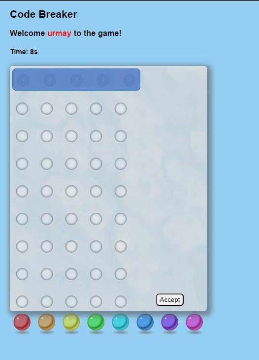

# Code-Breaker
Code-Breaker Multiplayer Game

Code Breaker is an exciting and interactive web-based game that I developed as a project using technologies such as HTML, CSS, JavaScript and jQuery.

The game invites players to use their logical and analytical skills to figure out a hidden pattern of multi-colored balls by making a series of guesses. 

As the creator, I designed the gameplay to involve users submitting their guesses, receiving feedback on the accuracy of their attempts, and continuing to guess until they successfully crack the code.

I hosted the game on a reliable server and skillfully implemented both client and server-side components, allowing users to enjoy multiple game attempts and a smooth gaming experience.

